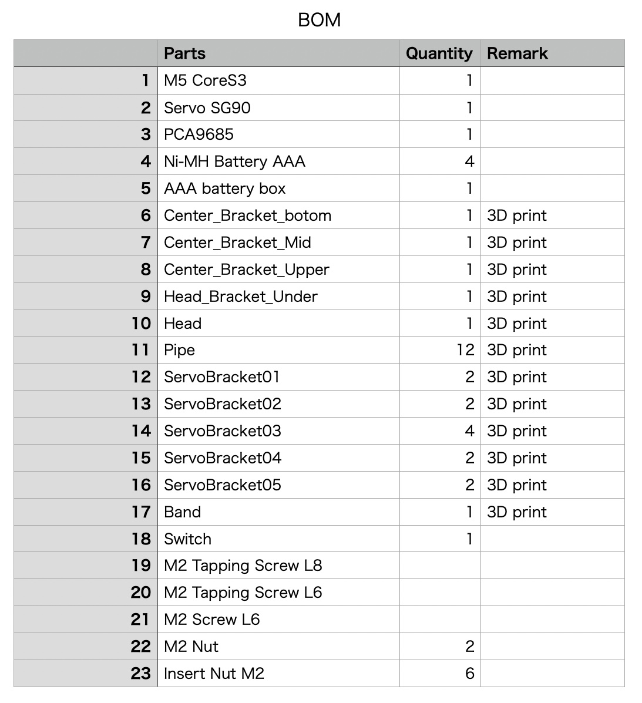

# NX23

[Summary]
http://robo-takao.jp/NX23/e/index.html

[Movie]  
https://youtu.be/lgQTTmdJifQ

[Components]  
1)M5 CoreS3  
2)Servo SG90 x12  
3)Battery NiMH 1.2V x 4 = 4.8V  
4)PCA9685 Servo Driver board  

[Connection]  

[3D model]  

[BOM]  

[Code]  
M5CoreS3
 NX23_M5CoreS3_walk_JoyC_ik_IMU  
M5StickC with JoyC
 NX23_M5StickC_joyC  

[Akitsuki PCA9685 Libraly]
https://akizukidenshi.com/goodsaffix/PCA9685.zip
