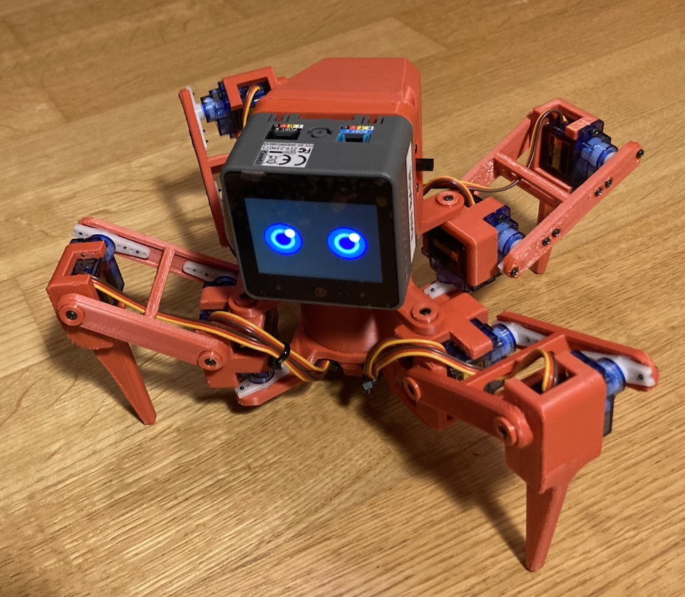
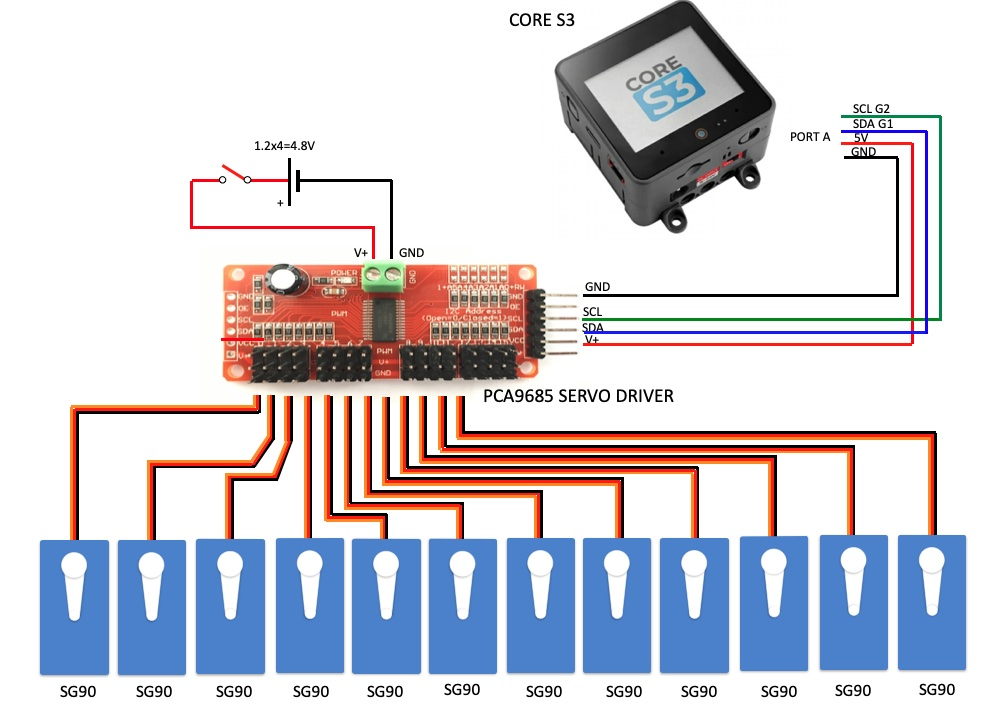
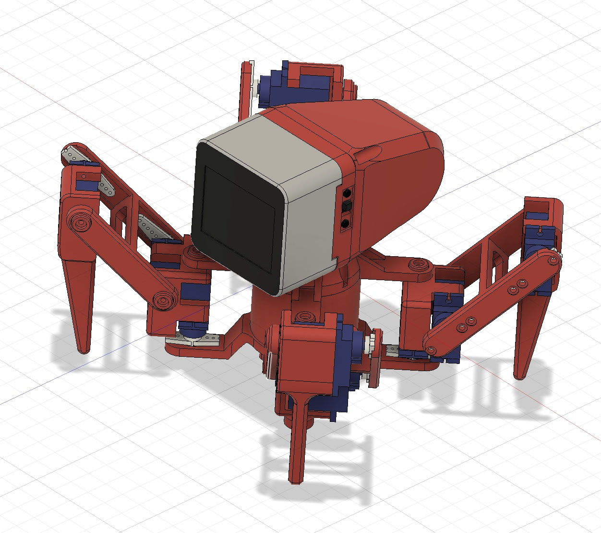

# NX23

Summary
http://robo-takao.jp/NX23/e/index.html

[Components]  
1)M5 CoreS3  
2)Servo SG90 x12  
3)Battery NiMH 1.2V x 4 = 4.8V  
4)PCA9685 Servo Driver board  

[Connection]  

[3D model]  

